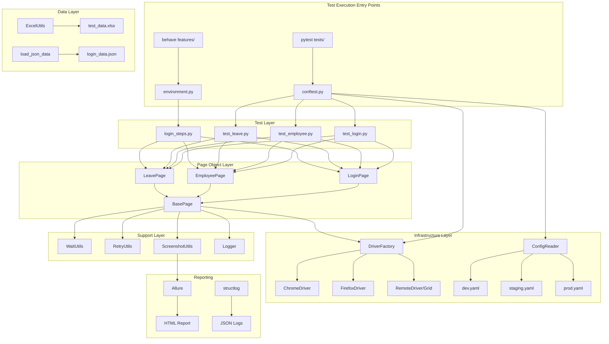

# Architecture — Enterprise Selenium + PyTest HRM Framework

## Framework Design Philosophy

This framework follows **SOLID principles** applied to test automation:

| Principle | Application |
|-----------|------------|
| **S**ingle Responsibility | Each class has one job: `LoginPage` handles only login, `WaitUtils` only wraps waits |
| **O**pen/Closed | Add a new page by extending `BasePage` — no modification required |
| **L**iskov Substitution | All page classes substitutable for `BasePage` |
| **I**nterface Segregation | `WaitUtils` separate from `ScreenshotUtils` — consumers import only what they need |
| **D**ependency Inversion | `tests/` depend on page abstractions, not Selenium directly |

---

## Architecture Diagram (Mermaid)



---

## Design Patterns In Depth

### 1. Page Object Model (POM)

```
BasePage (abstract operations)
    │
    ├── LoginPage
    │     ├── open()
    │     ├── login(username, password)
    │     ├── is_dashboard_visible()
    │     └── get_error_message()
    │
    ├── EmployeePage
    │     ├── add_employee(...)
    │     ├── search_employee(...)
    │     └── is_no_records_displayed()
    │
    └── LeavePage
          ├── apply_leave(...)
          └── get_leave_balance()
```

**Rule**: Tests never call `driver.find_element()` directly. All browser interactions go through page objects.

---

### 2. Singleton Pattern — DriverFactory

```python
# Thread-local singleton: one driver per parallel worker
_thread_local = threading.local()

class DriverFactory:
    @staticmethod
    def get_driver(...) -> WebDriver:
        if getattr(_thread_local, "driver", None) is not None:
            return _thread_local.driver  # ← Return existing
        # ... create new driver ...
        _thread_local.driver = driver
        return driver
```

**Why thread-local?** `pytest-xdist` runs each worker in a separate thread. Thread-local storage ensures each parallel worker gets its own browser without sharing state.

---

### 3. Factory Pattern — Browser Creation

```python
def _create_local(browser: str, headless: bool, config) -> WebDriver:
    if browser == "chrome":
        return webdriver.Chrome(...)     # ← Chrome factory
    elif browser == "firefox":
        return webdriver.Firefox(...)    # ← Firefox factory
    elif browser == "edge":
        return webdriver.Edge(...)       # ← Edge factory
```

Adding a new browser = add a new `elif` branch. Test code never changes.

---

### 4. Strategy Pattern — Configuration

```python
class ConfigReader:
    def _load(self):
        env = os.environ.get("ENV", "dev")  # ← Strategy selector
        config_file = CONFIG_DIR / f"{env}.yaml"
        # Loads dev.yaml / staging.yaml / prod.yaml
```

The **strategy** (which config to load) is determined at runtime by the `ENV` variable. The same `config.base_url` call returns different URLs on dev vs staging.

---

## Data Flow

```
Test Method
    │
    ▼ calls
Page Method (e.g., login_page.login("Admin", "admin123"))
    │
    ▼ calls
BasePage.type_text(USERNAME_INPUT, "Admin")
    │
    ├── WaitUtils.for_element_clickable(locator)   → Explicit wait
    ├── @retry_on_failure                           → Retry on StaleElement
    ├── element.send_keys("Admin")                  → Selenium action
    └── logger.debug("text_typed", ...)             → Structured log
```

---

## Parallel Execution Architecture

```
pytest -n 4 tests/
    │
    ├── Worker 1 → Thread-Local Driver 1 (Chrome) → test_login.py
    ├── Worker 2 → Thread-Local Driver 2 (Chrome) → test_employee.py
    ├── Worker 3 → Thread-Local Driver 3 (Chrome) → test_leave.py
    └── Worker 4 → Thread-Local Driver 4 (Chrome) → test_recruitment.py
                                                           │
                                        All write to Allure results (thread-safe)
                                        All write to rotating log file (thread-safe)
```

---

## CI/CD Pipeline Flow

```
Developer
    │ git push feature/TC-LGN-011
    ▼
GitHub
    │ triggers
    ▼
GitHub Actions
    ├── lint       (flake8 + black check)
    ├── smoke      (Chrome headless ~5 min)
    └── regression (Chrome + Firefox parallel, nightly)
    │
    ├── PASS → Docker build → Push to registry
    └── FAIL → Slack alert + Allure report published
    │
    ▼
Jenkins (on merge to main)
    ├── Full regression run
    ├── Docker tag + push
    └── K8s deploy (if DEPLOY_K8S=true)
    │
    ▼
Kubernetes (selenium-hrm namespace)
    ├── Selenium Hub (1 replica)
    ├── Chrome Nodes (3 replicas, HPA: 3–10)
    └── Test Runner Job
    │
    ▼
Allure Report Server (port 5252)
    │
    ▼
Slack #qa-alerts (Pass/Fail summary)
```

---

## Technology Stack

| Layer | Technology | Version | Purpose |
|-------|-----------|---------|---------|
| Language | Python | 3.12 | Test code |
| Test runner | PyTest | 8.3 | Discovery, fixtures, reporting |
| Browser automation | Selenium | 4.23 | UI interactions |
| BDD | Behave | 1.2.6 | Gherkin feature files |
| Reporting | Allure | 2.13 | HTML reports with history |
| Logging | structlog | 24.4 | JSON structured logs |
| Config | PyYAML | 6.0.2 | Multi-environment configs |
| Data | openpyxl + Faker | 3.1.5 | Excel data + data generation |
| Retry | tenacity | 9.0 | Retry logic with backoff |
| Parallel | pytest-xdist | 3.6 | Distributed test execution |
| Container | Docker | 26+ | Isolated test environments |
| Orchestration | Kubernetes | 1.29+ | Scalable test infrastructure |
| CI | Jenkins + GitHub Actions | LTS | Automated pipeline |
